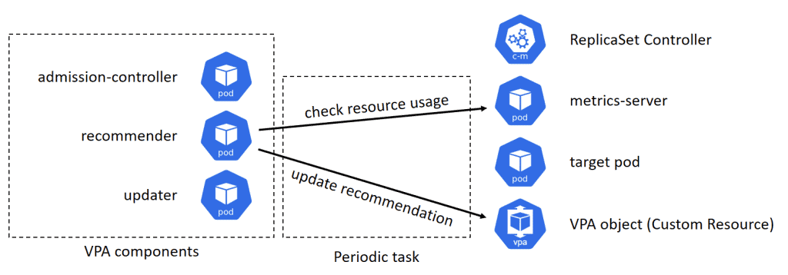
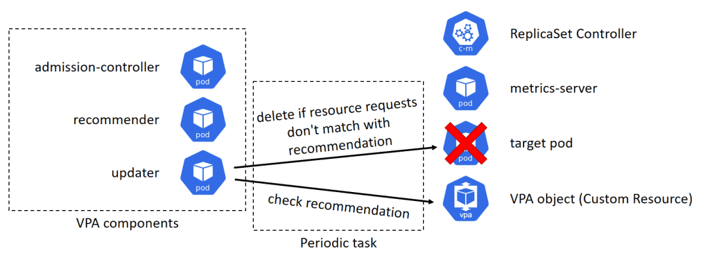
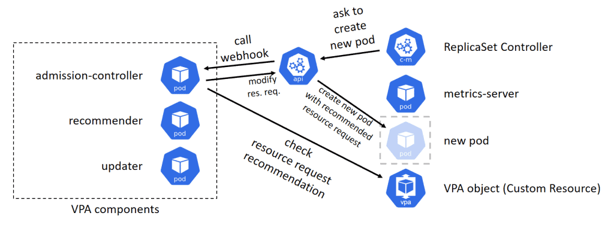

# Vertical Pod Autoscaler

## VPA Recommender

The recommender checks the resource usage of the target pods, and estimate the recommended resource requests, then update the VPA object associated to the target pods. This process is performed periodically.

## VPA Updator

The updater checks the recommended resource requests recorded in the VPA object, and if the current resource requests of the target pod are not match with the recommendation, it deletes the pod.

## VPA Admission Controller

The admission-controller register an admission webhook to modify pod creation request.

